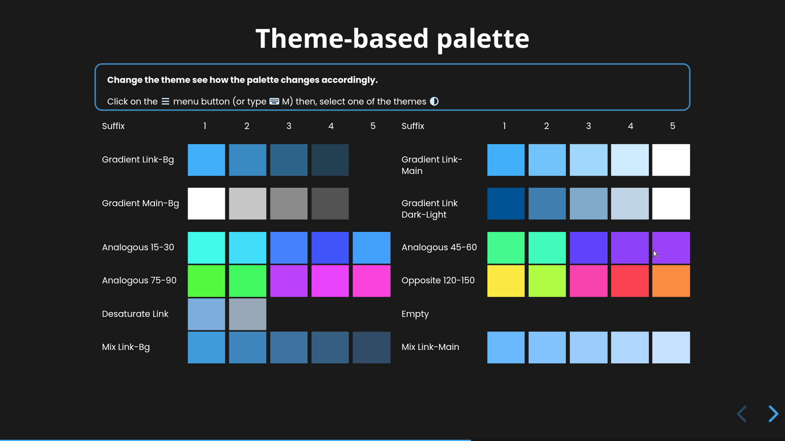
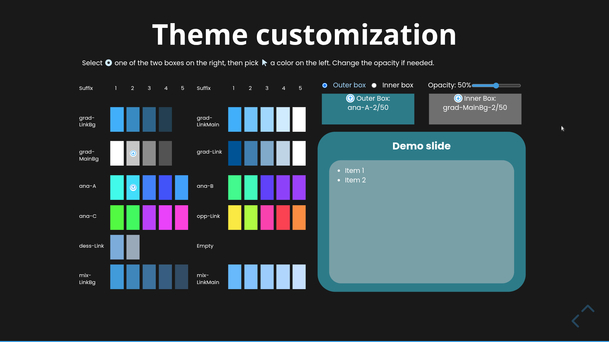

# Interactive Reveal.js presentation for customization with theme-derived colors


## Description

An interactive [Reveal.js](https://revealjs.com/) presentation for the customization of background boxes using theme-derived colors generated with the [Chroma.js](https://gka.github.io/chroma.js/) library.

Two background boxes are defined to delimit the contents of the slide. The first, called `outer-box`, marks the boundaries of the slide (including the title) while the second, called `inner-box`, marks the boundaries of the slide's contents whether it is one or multiple boxes.

A color palette was generated using 3 color variables that are common to all Reveal.js' built-in themes.

-   Link color: `--r-link-color`
-   Background color: `--r-background-color`
-   Text color: `--r-main-color`



The palette contains *gradients*, *combinations* and *related* colors to those mentioned above. The following list describes them in detail along with the name given in the code.

-   **Gradients**:
    -   Link and Background colors: `grad-LinkBg`
    -   Link and Main colors: `grad-LinkMain`
    -   Main and Background colors: `grad-MainBg`
    -   Dark and Light versions of the Link color: `grad-Link`
-   **Related to Link color:** (relative to the color wheel)
    -   Analogous colors at ±15, ±30 and +5 degrees: `ana-A`
    -   Analogous colors at ±45, ±60 and +65 degrees: `ana-B`
    -   Analogous colors at ±75, ±90 and +105 degrees: `ana-C`
    -   Opposite colors at ±120, ±150 and 180 degrees: `opp-Link`
-   **Combinations**: At different percentages of the 2nd color: 12.5%, 25%, 37.5%, 50% and 62.5%
    -   Link and Background colors: `mix-LinkBg`
    -   Link and Main colors: `mix-LinkMain`

Two custom JavaScript files (`ifunctions.js` and `icustom.js`) were written to generate the palette. Generally, the first script defines the functions to generate the different subsets of colors and functions that allow the user to apply them to the two background boxes described. The second script sets the initial values and updates them when the theme is changed using the Reveal.js third-party plugin, [menu](https://github.com/denehyg/reveal.js-menu).

Internally, the scripts will modify two CSS variables (`--bg-outBox` and `--bg-innBox`) which in turn set the background of the custom classes, `.bg-outer-box` and `.bg-inner-box`. Default values were chosen for each class when the variables are not defined which occurs when the presentation is loaded

```css
/* Backgrounds */
.bg-outer-box { background-color: var(--bg-outBox, var(--clr-ana-A-2)); }
.bg-inner-box { background-color: var(--bg-innBox, var(--clr-grad-MainBg-2)); }
```

A slide is provided with the palette and controls to select the background box and customize the opacity of the applied color.



The selected color and opacity value is presented in a dedicated box so its value can be used to customize future presentations through the tailwind utilities, `@utility bg-outer-box` and `@utility bg-inner-box` defined in the `base.css` file.

```css
@utility bg-outer-box {
    /* @apply  bg-ana-A-2/45 */
}

@utility bg-inner-box {
    /* @apply bg-grad-MainBg-2/50 */
}
```

The slide provides a preview box for how the selected options would be rendered on a slide. Change the theme to see the effect of the selected settings on other themes.


## Live version

-   [[Here](https://ssl-bio.github.io/Reveal.js_demo5)]


### Build/tested with:

The presentation was build using:

-   **nodejs**: *v20.19.6*
-   **TailwindCSS**:
    -   tailwindcss/cli: *v4.1.18*
-   **Reveal.js**:
    -   Local: *v. 5.2.1* (commit 33bfe3b2)
    -   CDN: *v 5.2.1*
-   **Chroma.js**:
    -   CDN: *v2.4.2*
-   **FontAwesome**:
    -   CDN: *v7.0.1*


## Quick setup [local]


### Download reveal.js

The following code will clone/download reveal.js.

```sh
# Option 1 Download the zip file
# wget https://github.com/hakimel/reveal.js/archive/master.zip -O reveal_js.zip

# Option 2 - Clone the repository
git clone https://github.com/hakimel/reveal.js.git
```


### Installation of Tailwind CLI

The following commands will setup a virtual environment where node.js will be installed and used to install tailwind command line interface (CLI).

```bash
  # Anaconda is required
  # Create a new virtual environment to install node.js
  conda create --name reveal-js -y
  conda activate reveal-js
  conda install anaconda::nodejs -y

  # Change to the presentation folder
  # cd /path/to/reveal/presentation/folder

# Install tailwindcss (locally)
npm install tailwindcss @tailwindcss/cli
```


### Building the final CSS file

The code below was taken from the official [installation instructions](https://tailwindcss.com/docs/installation/tailwind-cli). The `--watch` flag is necessary while making the presentation to update the final CSS file with the utilities and classes used.

```bash
conda activate reveal-js
npx @tailwindcss/cli -i ./src/css/base.css -o ./src/css/style.css --watch
```


### Modify the presentation file to run it locally

Once reveal.js has been downloaded and tailwind installed (and running), it is possible to modify the presentation file to run it locally by changing the following lines.

```html
<!-- Comment or delete the url for the reveal.js CDN -->
<link rel="stylesheet" href="https://cdn.jsdelivr.net/npm/reveal.js@5.2.1/dist/reveal.css"/>

<!-- Set a local path to the themes folder for the 'Reveal.initialize' property close to the end of the body element -->
Reveal.initialize({
<!-- Other properties are not shown -->
menu:{ themes:true, themesPath:'/absolute/path/to/reveal-files/reveal.js/dist/theme}, 
});
```
